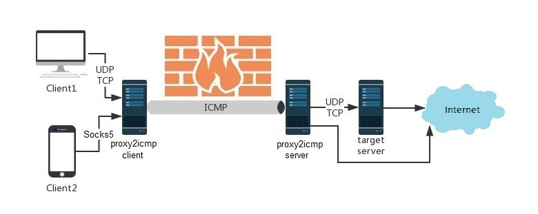

# proxy2icmp
<div align="center">

[](https://go.dev/dl/) 
[](https://go.dev/dl/)
</div>

this tool bypass firewall and filttering that send TCP/UDP traffic over ICMP.<br />

- [proxy2icmp](#proxy2icmp)
  - [How it\`s work](#how-its-work)
  - [Quick start](#quick-start)
      - [Build Static](#build-static)
      - [Install server](#install-server)
      - [Install the client](#install-the-client)
  - [Encryption](#encryption)
  - [Example](#example)
    - [client:](#client)
    - [server:](#server)
  - [Service](#service)
      - [server side:](#server-side)
      - [client side:](#client-side)
  - [Server service log](#server-service-log)
  - [Client service log](#client-service-log)
  - [Logger](#logger)
  - [(Optional) Disable system default ping](#optional-disable-system-default-ping)
  - [Cross compile](#cross-compile)

## How it`s work
run a server app for any client app with any(tcp\udp\socks5) protocol on client side.<br />
notice that when use tcp or udp protocols , packets must be forward to target server(local or remote) but it not need for socks5.



## Quick start
#### Build Static
-   cd to cmd/proxy2icmp in root directory of project and use go command to compile app as static libs  
```
GOOS=linux GOARCH=amd64 CGO_ENABLED=0 go build -o proxy2icmp -ldflags="-extldflags=-static"
```
#### Install server
-   First prepare a server with a public IP, such as EC2 on AWS, assuming the domain name or public IP is www.yourserver.com
```
sudo ./proxy2icmp -type server
```

-   (Optional) Disable system default ping
```
echo 1 > /proc/sys/net/ipv4/icmp_echo_ignore_all
```
#### Install the client

-   Forward socks5

```
sudo ./proxy2icmp -type client -l :4455 -s www.yourserver.com -sock5 1
```

-   Forward tcp

```
sudo ./proxy2icmp -type client -l :4455 -s www.yourserver.com -t www.yourserver.com:4455 -tcp 1
```

-   Forward udp

```
sudo ./proxy2icmp -type client -l :4455 -s www.yourserver.com -t www.yourserver.com:4455
```

## Encryption

to secure messages between client and server you can enable encrytion with -encryption flage.default is off.
notice when you want encryption, you must enable it on both server and client.

-   server:
```
sudo ./proxy2icmp -type server -encryption
```
-   client:
```
sudo ./proxy2icmp -type client -encryption -l :4455 -s 192.168.10.123 -t 192.168.10.16:8181 -tcp 1
```

## Example
### client:
-   socks5:
```
sudo ./proxy2icmp -type client -l 0.0.0.0:1080 -s 192.168.10.123 -sock5 1
```

-   tcp:
```
sudo ./proxy2icmp -type client -l :4455 -s 192.168.10.123 -t 192.168.10.16:8181 -tcp 1
```

-   udp:
```
sudo ./proxy2icmp -type client -l :4455 -s 192.168.10.123 -t 192.168.10.16:1194
```
### server:
```
sudo ./proxy2icmp -type server
```

## Service
run this app as a service

#### server side:

./service.sh `server`

```
sudo ./service.sh server
```

#### client side:

./service.sh `client` `<listenIp>` `<serverIp>` `<port>` `<protocol>`

-   socks5:
```
sudo ./service.sh client 192.168.10.123 192.168.10.16 8443 sock5
```

-   tcp:
```
sudo ./service.sh client 192.168.10.123 192.168.10.16 8443 tcp
```

-   udp:
```
sudo ./service.sh client 192.168.10.123 192.168.10.16 8443 udp
```

## Server service log
you can see service logs with this👇 command.
```bash
sudo journalctl -xefu p2iServer.service
```

## Client service log
you can see service logs with this👇 command.
```bash
sudo journalctl -xefu p2iClient.service
```


## Logger
chose write log on stdout or file or devNull.<br />
use `-log` flage to do this.<br />
stdout(default) = 0
file = 1
devNull = 2

-   server:
```
sudo ./proxy2icmp -type server -log 2
```
-   client:
```
sudo ./proxy2icmp -type client -encryption -l :4455 -s 192.168.10.123 -t 192.168.10.16:8181 -tcp 1 -log 1
```


 ## (Optional) Disable system default ping
```
echo 1 > /proc/sys/net/ipv4/icmp_echo_ignore_all
```

## Cross compile
after you installing go , you can cross compile this tool to any os and any architecture that go supported:</br>
you can build exe file for linux with this👇 go command statically linked shared librarys.</br>
windows:
-   386:
```sh
GOOS=windows GOARCH=386 CGO_ENABLED=0 go build -o proxy2icmp_windows-386.exe -ldflags="-extldflags=-static"
```
-   arm64:
```sh
GOOS=windows GOARCH=amd64 CGO_ENABLED=0 go build -o proxy2icmp_windows-amd64.exe -ldflags="-extldflags=-static"
```

linux:
-   386:
```sh
GOOS=linux GOARCH=386 CGO_ENABLED=0 go build -o proxy2icmp_linux-386 -ldflags="-extldflags=-static"
```
-   amd64:
```sh
GOOS=linux GOARCH=amd64 CGO_ENABLED=0 go build -o proxy2icmp_linux-amd64 -ldflags="-extldflags=-static"
```
-   arm64:
```sh
GOOS=linux GOARCH=arm64 CGO_ENABLED=0 go build -o proxy2icmp_linux-arm64 -ldflags="-extldflags=-static"
```

OR </br>
```sh
make build-all
```


